# Architecture & Decisions

This document captures the technical decisions behind the site and why they were made.

## Goals

The site is the primary web presence for Resolve Technology, an IT consulting / MSP firm.
The priorities, in order, are:

1. **Fast page loads** — first impressions matter for prospective clients.
2. **Trustworthiness** — the company provides managed IT, security, and compliance services;
   the site should be polished, secure, and reliable.
3. **Low operating cost / low maintenance** — the site should not require a running
   application server, a database, or ongoing patching of a CMS.
4. **Easy content updates** — pages are authored in a single, readable format.

## Key Decisions

### Static site generation with Astro

**Decision:** Use [Astro](https://astro.build) with static output.

**Why:** Astro ships zero JavaScript by default and renders everything to plain HTML/CSS at
build time. For a content-driven site like this it is ideal — pages load instantly, there
is no hydration cost, and the output is trivially cacheable. Astro's component model
(`.astro` files) keeps markup, scoped styles, and light logic together without pulling in a
full client-side framework like React or Vue.

**Trade-off:** Anything genuinely dynamic (form submission, personalization) must be handled
by an external service or a sprinkle of client JS, rather than server code. For this site
that is a feature, not a limitation — see Formspree and Alpine.js below.

### Tailwind CSS for styling

**Decision:** Use [Tailwind CSS 3.x](https://tailwindcss.com) via the official
`@astrojs/tailwind` integration, with a small set of component classes in `global.css`.

**Why:** Utility-first CSS keeps styling co-located with markup and avoids a sprawling,
hard-to-maintain stylesheet. The brand palette is defined once as Tailwind theme extensions
(`resolve-blue`, `resolve-teal`, etc.) so colors stay consistent across every page. A handful
of repeated patterns (buttons, sections, cards) are promoted to named classes in
`@layer components` to avoid copy-pasting long utility strings.

**Trade-off:** Tailwind 3 is used rather than Tailwind 4 to match the stable
`@astrojs/tailwind` integration at build time. The other CK Technology sites run Tailwind 4
via the Vite plugin; this site can be migrated later if desired.

### Alpine.js for the one piece of interactivity

**Decision:** Use [Alpine.js](https://alpinejs.dev) (loaded from a CDN) only for the mobile
navigation toggle.

**Why:** The site needs almost no client-side behavior. Pulling in a full framework for a
single hamburger menu would be wasteful. Alpine provides declarative `x-data`/`x-show`
directives inline in the markup with a tiny footprint and no build step.

**Trade-off:** Alpine is loaded from a CDN with `defer`, which adds one external request. For
a single interaction this is an acceptable cost and keeps the bundle out of the build.

### TypeScript with Astro's strict config

**Decision:** Extend `astro/tsconfigs/strict` and define path aliases.

**Why:** Strict typing catches mistakes in component props early. Path aliases
(`@components/*`, `@layouts/*`, `@/*`) keep imports readable instead of deep relative paths.

### Forms via Formspree

**Decision:** Send the contact form to [Formspree](https://formspree.io) (form ID
`xdawqlqg`) rather than running a backend.

**Why:** A static site has no server to receive POSTs. Formspree handles delivery, spam
filtering, and notifications without infrastructure. This keeps the entire site as static
files and avoids standing up and securing a mail-handling service.

**Trade-off:** Form data passes through a third party. No other analytics or tracking is
loaded, keeping the privacy surface small.

### Inline SVG icons

**Decision:** Define icons as inline SVG strings in `src/components/icons.ts`.

**Why:** Inline SVGs render with the page (no extra requests, no icon-font FOUT), inherit
`currentColor` for easy theming, and avoid a dependency on an icon library.

### NGINX for hosting

**Decision:** Serve the built `dist/` directory as static files behind NGINX over HTTPS.

**Why:** Static files behind NGINX are about as fast, cheap, and secure as web hosting gets —
no runtime to exploit or keep patched. NGINX also handles the HTTP→HTTPS redirect, long-lived
caching headers for assets, gzip, security headers, and the `help.resolvetech.biz` rewrite.
See [deployment.md](deployment.md).

## Resulting Architecture

```mermaid
%%{init: {'theme':'base','themeVariables':{'fontFamily':'Inter, system-ui, sans-serif','primaryColor':'#EFF6FF','primaryBorderColor':'#1B75BC','primaryTextColor':'#1F2937','lineColor':'#0D9DBF','fontSize':'14px'}}}%%
flowchart LR
    SRC["Author .astro<br/>pages + components"]:::dev
    BUILD["astro build · Vite"]:::dev
    DIST["dist/<br/>static HTML/CSS/JS"]:::dev
    NGX["Azure VM / NGINX<br/>resolvetech.biz · www · help"]:::host
    USER(["Visitors · HTTPS"]):::public
    FORM["Formspree"]:::external

    SRC --> BUILD --> DIST
    DIST ==>|"tar.gz + rclone<br/>over Tailscale"| NGX
    NGX --> USER
    USER -.->|"contact form POST"| FORM

    classDef dev fill:#EFF6FF,stroke:#1B75BC,stroke-width:1.5px,color:#1F2937;
    classDef host fill:#1B75BC,stroke:#0D9DBF,stroke-width:1.5px,color:#FFFFFF;
    classDef public fill:#F8FAFC,stroke:#6B7280,stroke-width:1.5px,color:#1F2937;
    classDef external fill:#FFF7ED,stroke:#F59E0B,stroke-width:1.5px,color:#9A3412;
```

No database, no application server, no server-side runtime to maintain. The host is locked
down behind Tailscale (key-based SSH only), TLS is automated with acme.sh + Let's Encrypt
(Azure DNS DNS-01), and the VM is backed up with Restic. See [deployment.md](deployment.md)
for the full pipeline and [security.md](security.md) for the network posture and CrowdSec
setup.
