# Deployment

The site builds to static files and is served by NGINX over HTTPS on an Azure VM. There is no
application runtime to deploy or keep running. All administrative access to the host happens
over a private Tailscale network — SSH is never exposed to the public internet.

## Overview

| | |
|---|---|
| **Build output** | `dist/` (static HTML/CSS/JS) |
| **Transfer** | `tar.gz` archive copied via `rclone` over SSH (SFTP) |
| **Transport** | Tailscale (private mesh VPN, key-based SSH, no password) |
| **Host** | Azure VM running NGINX (static site hosting) |
| **Web root** | `/var/www/resolvetech` |
| **Domains** | `resolvetech.biz`, `www.resolvetech.biz`, `help.resolvetech.biz` |
| **TLS** | acme.sh + Let's Encrypt, DNS-01 validation via Azure DNS |
| **Backups** | Restic snapshots to an S3-compatible bucket (Azure Blob) |
| **Configs** | `deploy/resolvetech.conf` (prod), `deploy/staging.resolvetech.conf` (staging) |

## Pipeline

```mermaid
%%{init: {'theme':'base','themeVariables':{'fontFamily':'Inter, system-ui, sans-serif','primaryColor':'#EFF6FF','primaryBorderColor':'#1B75BC','primaryTextColor':'#1F2937','lineColor':'#0D9DBF','fontSize':'14px'}}}%%
flowchart LR
    subgraph WS["Dev Workstation — Arch Linux"]
        direction TB
        BUILD["pnpm build<br/>generates dist/"]:::dev
        ARC["tar -czf<br/>resolvetech.tar.gz"]:::dev
        BUILD --> ARC
    end

    subgraph TS["Tailscale — private mesh VPN"]
        RC["rclone copy · SFTP<br/>key-based SSH, no password"]:::edge
    end

    subgraph VM["Azure VM — NGINX static host"]
        direction TB
        TMP["/tmp/resolvetech.tar.gz"]:::host
        WWW["extract into<br/>/var/www/resolvetech"]:::host
        RELOAD["nginx -t, then reload"]:::host
        TMP --> WWW --> RELOAD
    end

    PUB(["Public visitors · HTTPS 443<br/>resolvetech.biz · www · help"]):::public

    ARC ==>|"push over Tailscale"| RC
    RC ==> TMP
    RELOAD --> PUB

    classDef dev fill:#EFF6FF,stroke:#1B75BC,stroke-width:1.5px,color:#1F2937;
    classDef edge fill:#0D9DBF,stroke:#0A7D99,stroke-width:1.5px,color:#FFFFFF;
    classDef host fill:#1B75BC,stroke:#0D9DBF,stroke-width:1.5px,color:#FFFFFF;
    classDef public fill:#F8FAFC,stroke:#6B7280,stroke-width:1.5px,color:#1F2937;
```



Public visitors reach the site over HTTPS (443). The deploy and management path is entirely
private: the workstation connects to the VM by its Tailscale address using key-based SSH, so
port 22 is never published to the internet. See [security.md](security.md) for the full
network posture and the CrowdSec setup.

## Build

```bash
pnpm build
```

This produces a complete static site in `dist/`. Both the main site and the help portal are
built from the same project — the help portal is just the `/help` route, which NGINX maps to
the `help.resolvetech.biz` subdomain (see below).

## Transfer & Deploy

Archive the build and push it to the VM with `rclone` over its SSH/SFTP backend (the remote
points at the VM's Tailscale hostname and uses key-based auth):

```bash
# 1. Build and archive
pnpm build
tar -czf resolvetech.tar.gz -C dist .

# 2. Copy to the VM over Tailscale (rclone SFTP remote)
rclone copy resolvetech.tar.gz azurevm:/tmp/

# 3. On the VM: extract into the web root
ssh azurevm '
  sudo rm -rf /var/www/resolvetech/* &&
  sudo tar -xzf /tmp/resolvetech.tar.gz -C /var/www/resolvetech/ &&
  rm /tmp/resolvetech.tar.gz
'
```

`azurevm` is the Tailscale host (configured both as an `rclone` SFTP remote and an SSH host
alias). Because SSH is key-based and Tailscale-only, no passwords or public ingress are
involved. The local `resolvetech.tar.gz` is ignored by git (`*.tar.gz`) — clean it up after
deploying.

## NGINX Configuration

The production config lives at `deploy/resolvetech.conf`. Install it once:

```bash
sudo cp deploy/resolvetech.conf /etc/nginx/sites-available/resolvetech.conf
sudo ln -s /etc/nginx/sites-available/resolvetech.conf /etc/nginx/sites-enabled/
sudo nginx -t && sudo systemctl reload nginx
```

After any future config change:

```bash
sudo nginx -t && sudo systemctl reload nginx
```

### What the config does

- **HTTP → HTTPS redirect** for all three hostnames.
- **Main site** (`resolvetech.biz`, `www.resolvetech.biz`):
  - TLS 1.2/1.3 with ECDHE ciphers.
  - Security headers: `X-Frame-Options`, `X-Content-Type-Options`, `X-XSS-Protection`,
    `Referrer-Policy`.
  - Gzip for text assets.
  - 1-year immutable cache for images, CSS, JS, and fonts.
  - `try_files $uri $uri/ $uri.html =404` so clean URLs resolve to the generated `.html`
    files.
- **Help portal** (`help.resolvetech.biz`):
  - Shares the same web root and certificate.
  - Rewrites requests into the `/help` directory: `/` serves `/help/index.html`, and other
    paths fall back to `/help$uri`.
  - Adds `X-Robots-Tag: noindex, nofollow` so the portal stays out of search results.
  - Also caches PDFs (the downloadable contact info sheet).

## The Help Subdomain

There is no separate build or deploy for the help portal. It is the `/help` page in this same
project. When the main build is extracted into `/var/www/resolvetech/`, the help server block
serves `help.resolvetech.biz` from that same directory via the rewrite rules above.

## TLS Certificates

Certificates are issued and renewed automatically with [acme.sh](https://github.com/acmesh-official/acme.sh)
against Let's Encrypt, using **DNS-01** validation through **Azure DNS**:

- A single certificate covers `resolvetech.biz`, `www.resolvetech.biz`, and
  `help.resolvetech.biz`.
- DNS-01 (rather than HTTP-01) means the challenge is satisfied by creating TXT records in
  Azure DNS — no inbound HTTP exposure is needed to validate, which suits the locked-down
  network posture.
- acme.sh authenticates to Azure DNS via an Azure AD **app registration** (service principal)
  scoped to the DNS zone. The credentials live in acme.sh's environment on the VM
  (`AZUREDNS_*` variables) and are never committed to this repo.
- Renewals are automatic (acme.sh cron); the deploy hook reloads NGINX after a new cert is
  installed.

The certificate paths NGINX reads from:

```
/etc/nginx/certs/resolvetech.biz/fullchain.pem
/etc/nginx/certs/resolvetech.biz/privkey.pem
```

## Access & Network Posture

- **Tailscale** provides a private mesh network between the dev workstation and the Azure VM.
  All SSH and deploy traffic rides this overlay.
- **SSH** uses key-based authentication only (no password auth). Port 22 is not exposed to the
  public internet — the VM is reachable for administration only via its Tailscale address.
- **Public ingress** is limited to the web traffic NGINX serves over HTTPS.

## Backups

The VM is backed up with [Restic](https://restic.net):

- Restic takes deduplicated, encrypted snapshots and pushes them to an **S3-compatible object
  storage bucket** (Azure Blob).
- The repository password and storage credentials live on the VM (and/or in a secrets manager)
  and are never committed to this repo.
- Restore is `restic restore` from the bucket; because the site itself is reproducible from
  this repo (`pnpm build`), backups primarily protect server configuration, certificates, and
  any host-side state.

## Staging

`deploy/staging.resolvetech.conf` provides a staging server block for testing changes before
they hit production. Build and deploy to the staging web root using the same
archive-and-rclone flow, validate, then promote the same `dist/` to production.
