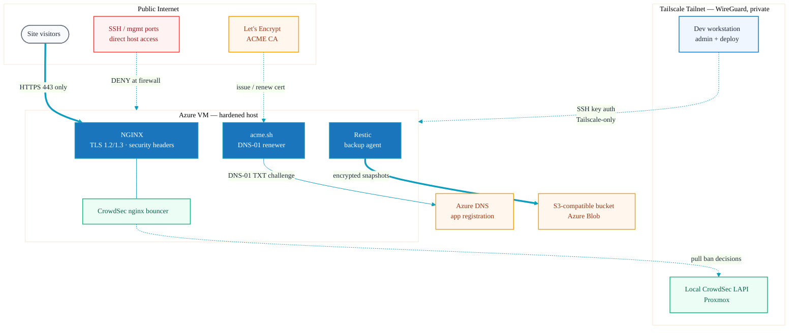
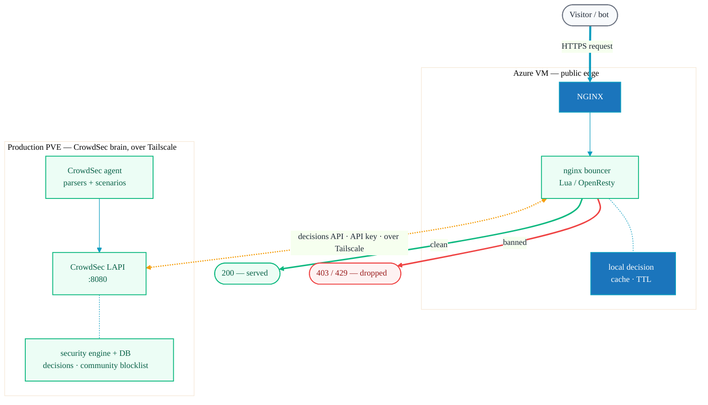
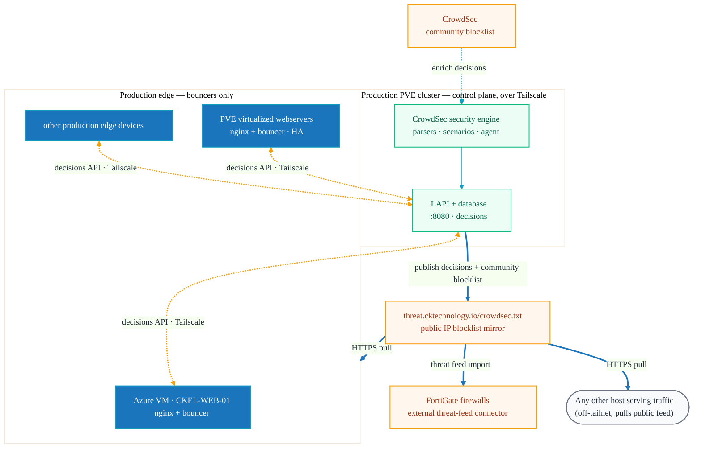
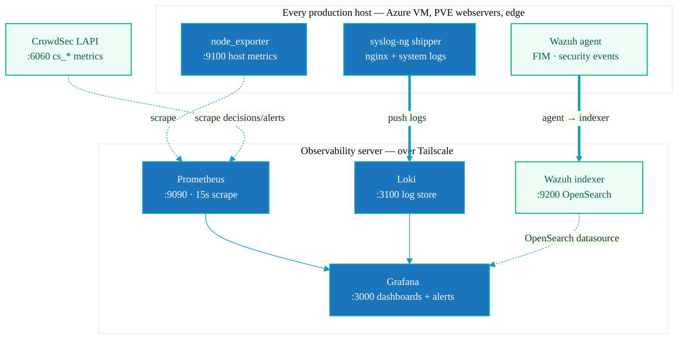

# Security Posture

How the site and its host are protected. The guiding principle is a **split between a public
data plane and a private control plane**: visitors only ever touch NGINX over HTTPS, while all
administration, deployment, and security signalling happen over a private Tailscale network.

## Trust Planes

**Reading the diagram**

- **Solid edges** are the public data path (visitors → NGINX) and outbound data the host owns
  (backups). **Dotted edges** are private control/observe flows (admin SSH, CrowdSec
  decisions, certificate renewal).
- The only inbound public exposure is **HTTPS/443**. SSH and management ports are blocked at
  the firewall and reachable only across the Tailscale mesh.
- Certificate issuance never needs inbound HTTP — acme.sh proves control via **DNS-01** by
  writing TXT records in Azure DNS (see [deployment.md](deployment.md#tls-certificates)).

## Controls Summary

| Layer | Control |
|-------|---------|
| **Transport (public)** | TLS 1.2/1.3, ECDHE ciphers, HTTP→HTTPS redirect |
| **HTTP headers** | `X-Frame-Options`, `X-Content-Type-Options`, `X-XSS-Protection`, `Referrer-Policy`; `noindex` on the help portal |
| **Host access** | Tailscale-only SSH, key-based auth, no password auth, port 22 not public |
| **Edge protection** | CrowdSec nginx bouncer enforcing decisions from a local CrowdSec LAPI |
| **Certificates** | acme.sh + Let's Encrypt, DNS-01 via Azure DNS (service principal) |
| **Attack surface** | Static files only — no app runtime, database, or CMS to exploit |
| **Backups** | Restic encrypted, deduplicated snapshots to S3-compatible storage |
| **Secrets** | Azure app-reg creds, Restic password, SSH keys live on the host only; never committed (`.gitignore` blocks `.env*`, `*.pem`, `*.key`) |

## CrowdSec — NGINX Bouncer

The Azure VM (`CKEL-WEB-01`) runs the **CrowdSec NGINX bouncer**, which checks every incoming
request against a decision list and blocks known-bad IPs before they reach the site. Rather
than running a full standalone CrowdSec install on the public edge, the bouncer **queries a
central CrowdSec security engine (LAPI + database) on the production PVE cluster over
Tailscale** — the decision-making and threat intelligence stay on the private control plane.
This is the same pattern used across every production edge (see
[Production Topology](#crowdsec--production-topology--threat-feed) below).

**How it works**

1. A request hits NGINX. The bouncer (Lua module / OpenResty) intercepts it before it is
   served.
2. The bouncer consults its local decision cache; on a miss or refresh interval it queries the
   **local CrowdSec LAPI over Tailscale** (`GET /v1/decisions`, authenticated with a bouncer
   API key). Because the call rides the tailnet, the LAPI is never exposed to the internet.
3. If the source IP carries an active **ban** decision, the request is dropped (`403`/`429`).
   Clean traffic is served normally.
4. The CrowdSec **agent** on the production PVE cluster maintains the decision list from parsed
   signals and the CrowdSec **community blocklist**, so the public edge benefits from shared
   threat intelligence without putting the brain on the public host.

> Log acquisition (which signals the agent parses) can run either locally on the VM shipping
> events to the central LAPI, or centrally — the enforcement path shown here (bouncer → central
> LAPI over Tailscale) is the part specific to this deployment.

## CrowdSec — Production Topology & Threat Feed

This site's bouncer is one node in a wider production setup. A **single CrowdSec security
engine + database (LAPI)** runs centrally on the production PVE cluster; every public edge runs
only a lightweight **bouncer** that consults it over Tailscale. The same brain also publishes a
**public blocklist mirror** at `https://threat.cktechnology.io/crowdsec.txt`, which any host —
including third-party or non-tailnet edges — can pull as a plain IP feed.

- **One brain, many edges.** Only the central engine holds the database and runs the
  decision-making logic. Edges (the Azure VM, PVE-hosted virtualized webservers behind HA, and
  the other production edge devices) carry just a bouncer, so there is no per-host CrowdSec DB
  to manage or expose.
- **Two distribution paths.** Tailnet edges pull live decisions over the private decisions API
  (amber, authenticated, never public). Anything that can't join the tailnet — third-party or
  external hosts — pulls the same intelligence from the public `crowdsec.txt` mirror (blue,
  plain HTTPS), so the threat feed travels even where Tailscale doesn't.
- **Block at scale via the firewalls.** The mirror publishes the engine's **decisions plus the
  community blocklist** as a single IP list. **FortiGate firewalls import it as an external
  threat feed** wherever applicable, so malicious actors are dropped at the network edge —
  before they ever reach a web server — across every site that consumes the feed.
- **Shared intelligence.** The CrowdSec community blocklist enriches the central engine, and
  every edge inherits it automatically — local scenarios plus crowd-sourced reputation.

## Observability — Metrics, Logs, and SIEM

Every production host (this Azure web VM included) ships telemetry to a central observability
stack reached over Tailscale. The stack is **observe-only**: it reads existing endpoints rather
than running security components itself.

- **Metrics** — `node_exporter` on each host and the **CrowdSec LAPI** (`:6060`, `cs_*`
  decision/alert metrics) are scraped by **Prometheus**, which drives alerting.
- **Logs** — `syslog-ng` ships nginx and system logs to **Loki** with low-cardinality labels
  (`host`, `app`, `severity`) for fast query-time filtering in Grafana.
- **SIEM** — **Wazuh** agents report file-integrity and security events to the Wazuh indexer
  (OpenSearch); **Grafana** reads it directly as a datasource alongside Prometheus and Loki,
  giving one pane for infra health, logs, and security signals.

## Zero Trust Management Plane

Across every environment the rule is the same: **nothing administrative is reachable from the
public internet.** The CrowdSec LAPI, the observability UIs (Grafana/Prometheus/Alertmanager),
the Wazuh indexer, and all SSH live only on the **Tailscale mesh**, gated by tight tailnet
**ACLs** so each host can reach exactly the services it needs and no more. Public ingress is
limited to HTTPS on the edge; everything else is default-deny at the host firewall. Least
privilege plus full observability is the whole point — see [Trust Planes](#trust-planes).

## What This Buys Us

- **Minimal public attack surface** — one port (443), static files, no server-side code.
- **No public management plane** — SSH and the CrowdSec brain live behind Tailscale.
- **Automated, hands-off TLS** — DNS-01 renewals with no inbound exposure.
- **Resilient** — encrypted off-host backups, and the site itself is fully reproducible from
  this repo with `pnpm build`.
