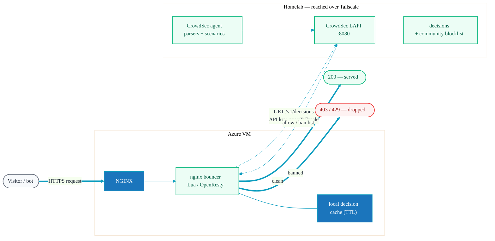

# Security Posture

How the site and its host are protected. The guiding principle is a **split between a public
data plane and a private control plane**: visitors only ever touch NGINX over HTTPS, while all
administration, deployment, and security signalling happen over a private Tailscale network.

## Trust Planes

**Reading the diagram**

- **Solid edges** are the public data path (visitors → NGINX) and outbound data the host owns
  (backups). **Dotted edges** are private control/observe flows (admin SSH, CrowdSec
  decisions, certificate renewal).
- The only inbound public exposure is **HTTPS/443**. SSH and management ports are blocked at
  the firewall and reachable only across the Tailscale mesh.
- Certificate issuance never needs inbound HTTP — acme.sh proves control via **DNS-01** by
  writing TXT records in Azure DNS (see [deployment.md](deployment.md#tls-certificates)).

## Controls Summary

| Layer | Control |
|-------|---------|
| **Transport (public)** | TLS 1.2/1.3, ECDHE ciphers, HTTP→HTTPS redirect |
| **HTTP headers** | `X-Frame-Options`, `X-Content-Type-Options`, `X-XSS-Protection`, `Referrer-Policy`; `noindex` on the help portal |
| **Host access** | Tailscale-only SSH, key-based auth, no password auth, port 22 not public |
| **Edge protection** | CrowdSec nginx bouncer enforcing decisions from a local CrowdSec LAPI |
| **Certificates** | acme.sh + Let's Encrypt, DNS-01 via Azure DNS (service principal) |
| **Attack surface** | Static files only — no app runtime, database, or CMS to exploit |
| **Backups** | Restic encrypted, deduplicated snapshots to S3-compatible storage |
| **Secrets** | Azure app-reg creds, Restic password, SSH keys live on the host only; never committed (`.gitignore` blocks `.env*`, `*.pem`, `*.key`) |

## CrowdSec — NGINX Bouncer

The Azure VM runs the **CrowdSec NGINX bouncer**, which checks every incoming request against
a decision list and blocks known-bad IPs before they reach the site. Rather than running a
full standalone CrowdSec install on the public VM, the bouncer **phones home to a local
CrowdSec server (LAPI) in the homelab over Tailscale** — the decision-making and threat
intelligence stay on the private network.

**How it works**

1. A request hits NGINX. The bouncer (Lua module / OpenResty) intercepts it before it is
   served.
2. The bouncer consults its local decision cache; on a miss or refresh interval it queries the
   **local CrowdSec LAPI over Tailscale** (`GET /v1/decisions`, authenticated with a bouncer
   API key). Because the call rides the tailnet, the LAPI is never exposed to the internet.
3. If the source IP carries an active **ban** decision, the request is dropped (`403`/`429`).
   Clean traffic is served normally.
4. The CrowdSec **agent** in the homelab maintains the decision list from parsed signals and
   the CrowdSec **community blocklist**, so the public edge benefits from shared threat
   intelligence without putting the brain on the public host.

> Log acquisition (which signals the agent parses) can run either locally on the VM shipping
> events to the central LAPI, or centrally — the enforcement path shown here (bouncer → local
> LAPI over Tailscale) is the part specific to this deployment.

## What This Buys Us

- **Minimal public attack surface** — one port (443), static files, no server-side code.
- **No public management plane** — SSH and the CrowdSec brain live behind Tailscale.
- **Automated, hands-off TLS** — DNS-01 renewals with no inbound exposure.
- **Resilient** — encrypted off-host backups, and the site itself is fully reproducible from
  this repo with `pnpm build`.
